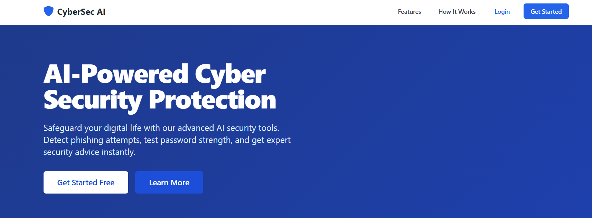
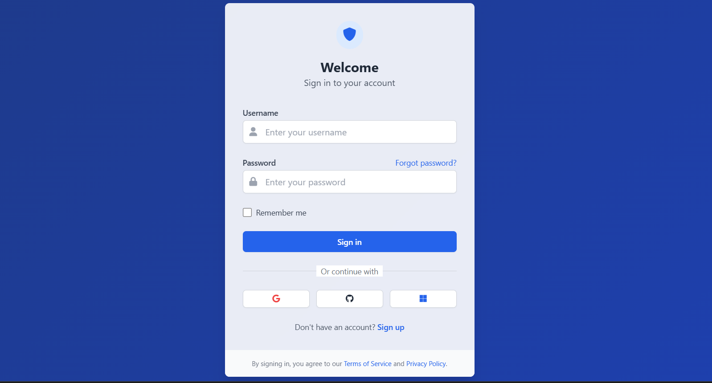
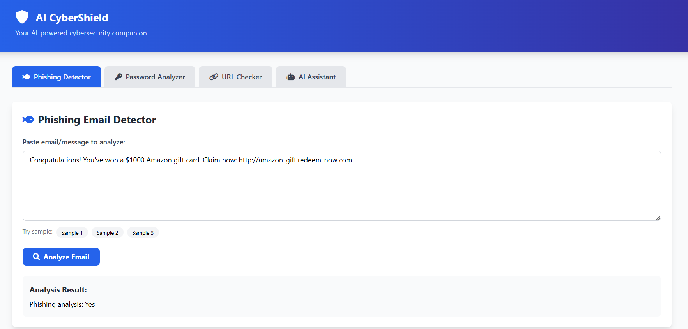
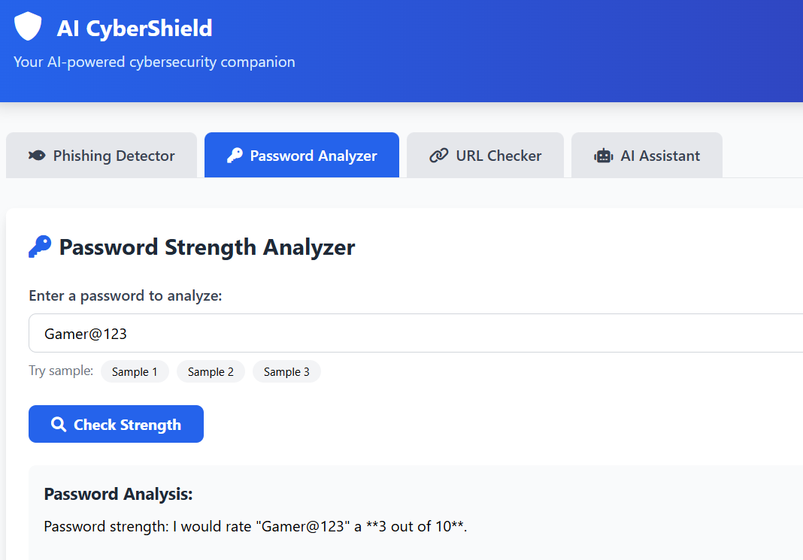
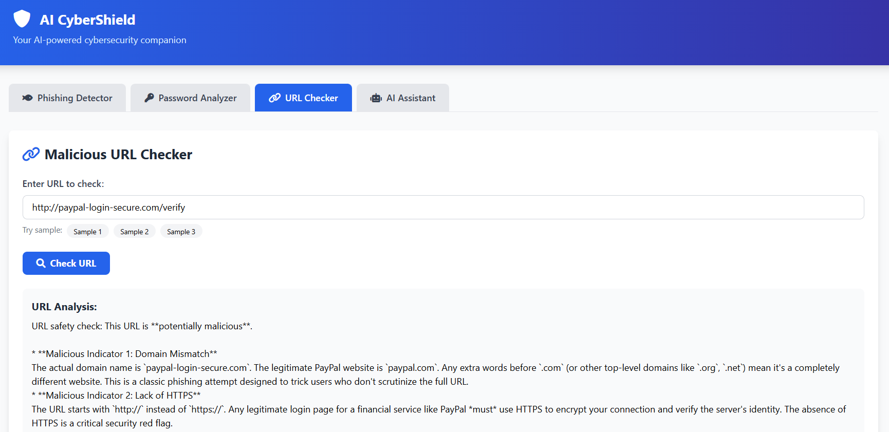
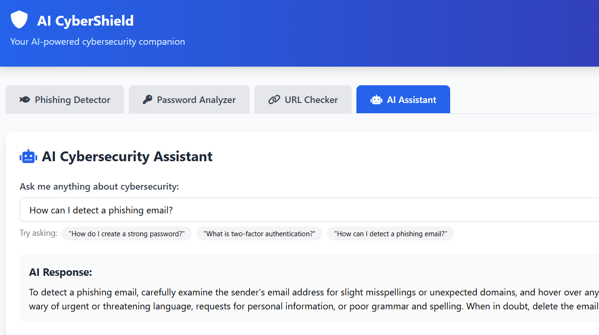

# 🛡️ AI Cyber Shield

<div align="center">

# 🤖 AI-Powered Cybersecurity Assistant

An intelligent cybersecurity platform built with **Flask**, **Python**, and **Google Gemini AI** to help users identify cyber threats, strengthen passwords, detect phishing attacks, analyze malicious URLs, and receive AI-powered cybersecurity guidance.


</div>

---

# 📖 Overview

AI Cyber Shield is an AI-powered cybersecurity assistant designed to improve cyber awareness and online safety.

The application leverages **Google Gemini AI** to analyze cybersecurity-related inputs and provide intelligent recommendations. Users can securely log in, detect phishing emails, analyze suspicious URLs, evaluate password strength, and interact with an AI assistant for cybersecurity guidance.

The project demonstrates the integration of Artificial Intelligence with modern web technologies to solve practical cybersecurity problems.

---

# ✨ Features

- 🔐 Secure User Authentication
- 📧 AI-based Phishing Email Detection
- 🔑 Password Strength Analysis
- 🌐 Malicious URL Detection
- 🤖 AI Cybersecurity Assistant
- 💾 SQLite Database Integration
- ⚡ Responsive User Interface
- 🔒 Secure API Key Management using `.env`

---

# 🛠 Tech Stack

| Category | Technologies |
|----------|--------------|
| Backend | Python, Flask |
| Frontend | HTML5, CSS3, JavaScript |
| Artificial Intelligence | Google Gemini API |
| Database | SQLite |
| Version Control | Git & GitHub |

---

# 📂 Project Structure

```text
AI-Cyber-Shield/
│
├── app.py
├── requirements.txt
├── README.md
├── .gitignore
├── .env
│
├── static/
│
├── templates/
│
└── screenshots/
```

---

# 🚀 Installation

### Clone Repository

```bash
git clone https://github.com/Yashu1829/AI-Cyber-Shield.git
```

### Move into Project

```bash
cd AI-Cyber-Shield
```

### Create Virtual Environment

```bash
python -m venv venv
```

### Activate Environment

#### Windows

```bash
venv\Scripts\activate
```

#### Linux / macOS

```bash
source venv/bin/activate
```

### Install Dependencies

```bash
pip install -r requirements.txt
```

### Configure Environment Variables

Create a file named

```text
.env
```

Add

```env
GOOGLE_API_KEY=YOUR_API_KEY
```

### Run Application

```bash
python app.py
```

Visit

```
http://127.0.0.1:5000
```

---

# 📸 Application Screenshots

## 🏠 Landing Page

The landing page introduces the platform and provides an overview of the cybersecurity tools available.



---

## 🔐 Login Page

Secure login system for authenticated users.



---

## 📧 Phishing Email Detector

Analyze suspicious emails using AI to detect phishing attempts and malicious content.



---

## 🔑 Password Strength Analyzer

Evaluate password security and receive recommendations for stronger passwords.



---

## 🌐 Malicious URL Checker

Analyze URLs and determine whether they are safe or potentially harmful.



---

## 🤖 AI Cybersecurity Assistant

Interact with an AI assistant for cybersecurity guidance, awareness, and best practices.



---

# ⚙️ Application Workflow

```text
            User Login
                 │
                 ▼
      Select Security Module
                 │
   ┌─────────────┼─────────────┐
   ▼             ▼             ▼
Phishing     Password      URL
Detection     Analysis    Analysis
                 │
                 ▼
      Google Gemini AI
                 │
                 ▼
     AI Security Recommendations
                 │
                 ▼
        Cybersecurity Assistant
```

---

# 🎯 Key Highlights

- AI-powered cybersecurity analysis
- Phishing email detection
- Password strength evaluation
- Malicious URL detection
- Google Gemini integration
- Secure authentication
- Responsive Flask application

---

# 💡 Future Enhancements

- 📱 Mobile Responsive UI
- 🌍 Live Threat Intelligence APIs
- ☁ Cloud Deployment
- 📊 Security Dashboard
- 📈 User History
- 🔍 Malware File Scanner
- 📂 Email Attachment Analysis
- 🛡 Browser Extension Support

---

# 📚 Learning Outcomes

Through this project, I gained hands-on experience with:

- Flask Framework
- Python Web Development
- Google Gemini API Integration
- SQLite Database
- User Authentication
- Prompt Engineering
- Cybersecurity Fundamentals
- Git & GitHub

---

# 🤝 Contributing

Contributions are welcome.

1. Fork the repository
2. Create a new feature branch

```bash
git checkout -b feature-name
```

3. Commit your changes

```bash
git commit -m "Add new feature"
```

4. Push your branch

```bash
git push origin feature-name
```

5. Open a Pull Request

---

# 📜 License

This project is licensed under the **MIT License**.

---

# 👨‍💻 Author

## Yashwanth Chanda

Artificial Intelligence & Machine Learning Student

GitHub: **https://github.com/Yashu1829**

---

<div align="center">

### ⭐ If you found this project useful, please consider giving it a star.

Made with ❤️ using Flask, Python & Google Gemini AI

</div>